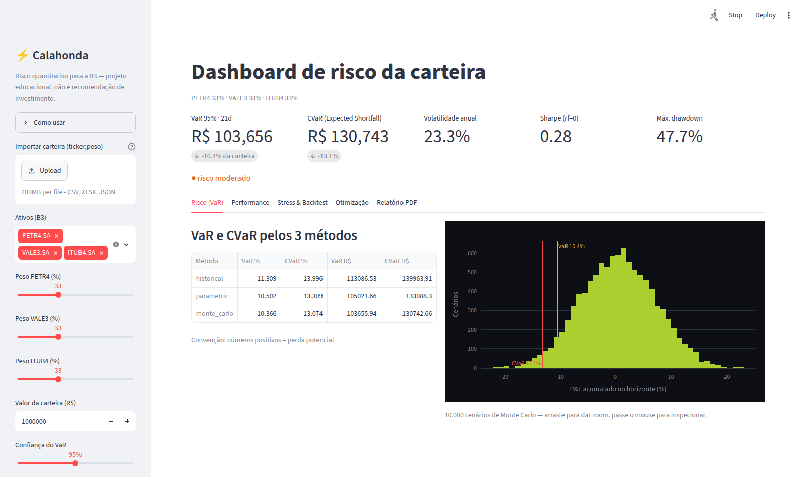
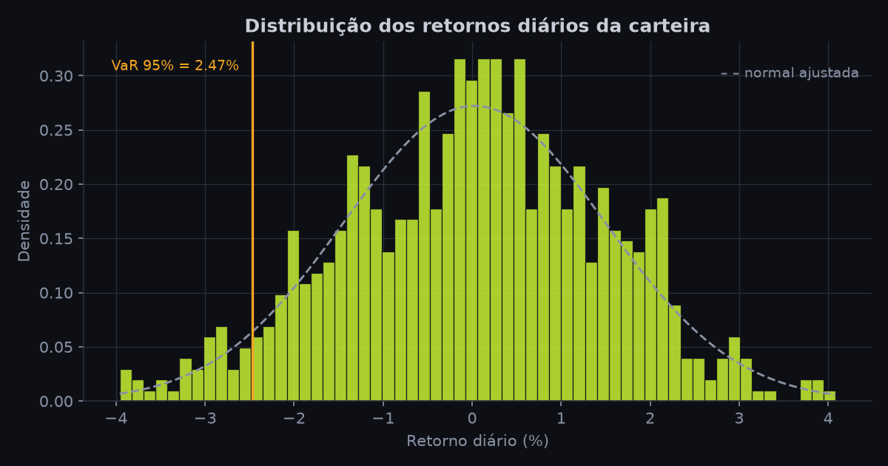
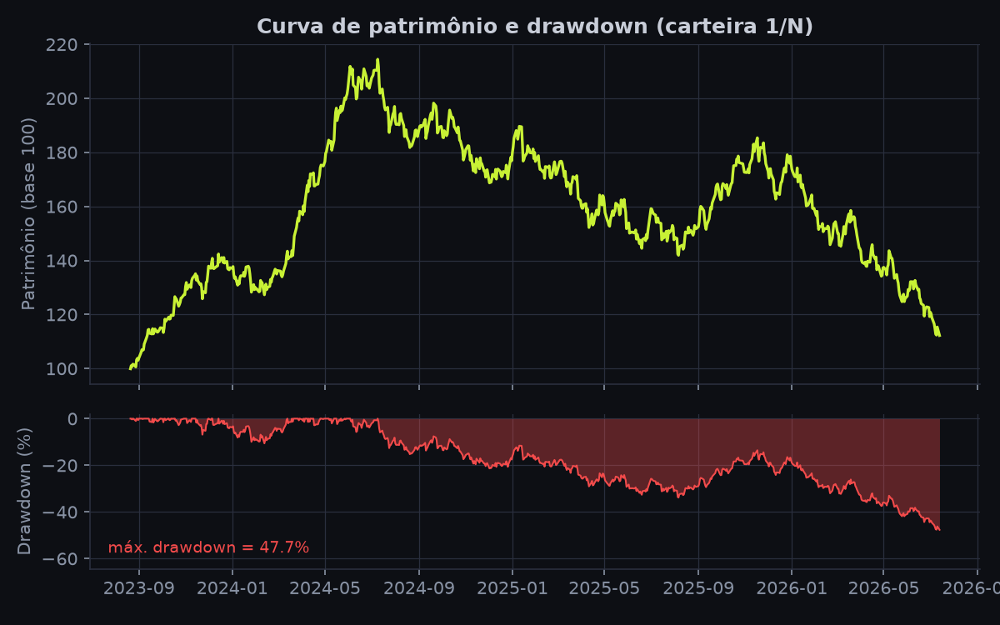
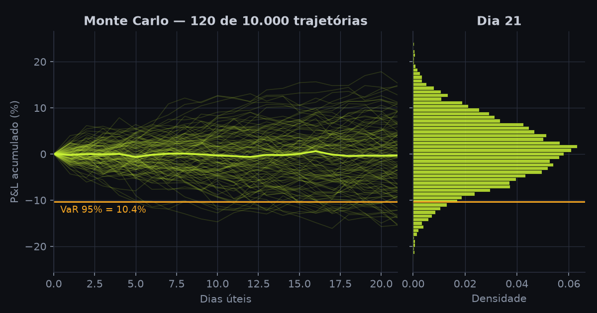

<div align="center">

# ⚡ Calahonda

**Finanças quantitativas para o mercado brasileiro (B3) — um projeto de portfólio.**

[](https://github.com/robertochiocca/calahonda/actions/workflows/ci.yml)
[](https://www.python.org/)
[](tests/)
[](.github/workflows/ci.yml)
[](https://github.com/psf/black)
[](https://github.com/astral-sh/ruff)
[](LICENSE)

**[🚀 App ao vivo / Live app](https://calahonda.streamlit.app)** · **[🌐 Site do projeto](https://robertochiocca.github.io/calahonda/)**

🇧🇷 [Português](#-versão-em-português) · 🇺🇸 [English](#-english-version)

</div>

> ℹ️ **Conceito / projeto de portfólio — não é uma empresa.** Este repositório estuda como uma plataforma de análise quantitativa focada em gestoras independentes brasileiras *poderia* funcionar. O front-end, o núcleo quant em Python (VaR, métricas, otimização, stress testing, backtest) e o dashboard web estão implementados e testados; o que resta (API, modelos de ML) é roadmap explicitamente sinalizado.

---

## 🇧🇷 Versão em Português

**Calahonda** é um projeto de portfólio que explora análise quantitativa aplicada ao mercado brasileiro. A hipótese: gestoras independentes menores raramente pagam pelas ferramentas quant internacionais (Bloomberg, FactSet, na casa dos milhares de dólares/mês), então há espaço para estudar uma alternativa focada na B3, em português.

Comecei pela peça mais concreta e testável de qualquer plataforma de risco: **o cálculo de VaR em Python**.

### 📊 O que já funciona (código real)

Um **módulo de Value at Risk (VaR) e Conditional VaR (CVaR)** em Python, com três métodos clássicos da indústria:

| Método | Ideia central |
|---|---|
| 📊 **Histórico** | quantil da distribuição empírica dos retornos |
| 📈 **Paramétrico** | variância-covariância (fórmula fechada, normal) |
| 🎲 **Monte Carlo** | 10.000 simulações com semente reprodutível |

Além do VaR, o módulo calcula **Sharpe, Sortino, Calmar, Omega, Treynor, Jensen Alpha, Information Ratio, tracking error, volatilidade anualizada, curva de patrimônio, drawdown máximo e matriz de correlação** — e otimiza carteiras (**mínima variância** e **máximo Sharpe**, long-only, via SciPy).

E a camada de **plataforma** também já existe: **dashboard web no ar** ([calahonda.streamlit.app](https://calahonda.streamlit.app), 6 abas) com **importação de carteira via CSV/Excel/JSON**, **stress testing** com cenários históricos e personalizados, **backtesting de VaR** (teste de Kupiec, janela móvel out-of-sample), **comparação de carteiras** e **relatório em PDF** para download.

Mais **25 testes unitários** — incluindo um que valida o resultado contra a teoria da distribuição normal (VaR 95% ≈ 1.645·σ). Roda 100% offline (dados sintéticos) ou com dados reais da B3 via `yfinance`.

> 🕹️ **Demo interativa:** a [página do projeto](https://robertochiocca.github.io/calahonda/#demo) roda 10.000 simulações de Monte Carlo direto no navegador — monte uma carteira e calcule o VaR.

**Stack:** Python 3.10+ · NumPy · pandas · SciPy · Streamlit · pytest

### 🚀 Como rodar

```bash
git clone https://github.com/robertochiocca/calahonda.git
cd calahonda
pip install -r requirements.txt

python examples/example_var.py   # exemplo completo
pytest                           # 25 testes
```

Saída real (carteira de R$1M em PETR4 + VALE3 + ITUB4, VaR 95% em 21 dias úteis):

```
              VaR %  CVaR %     VaR R$    CVaR R$
Método
historical   11.309  13.996  113086.53  139963.91
parametric   10.502  13.309  105021.66  133088.30
monte_carlo  10.366  13.074  103655.94  130742.66

Retorno anualizado :   6.55%
Volatilidade anual :  23.27%
Sharpe (rf=0)      :    0.28
```

### 🖥️ Dashboard web (Streamlit)



> **No ar:** [calahonda.streamlit.app](https://calahonda.streamlit.app)

```bash
streamlit run streamlit_app.py   # ou use o app publicado acima
```

Seis abas: **Risco (VaR)** · **Performance** · **Stress & Backtest** · **Otimização** · **Carteiras** · **Relatório PDF**. Gráficos **Plotly interativos** (zoom, hover, exportação), VaR classificado por cor (verde/âmbar/vermelho), **métricas avançadas** (Sortino, Calmar, Omega, Treynor, Jensen Alpha, Information Ratio), comparação **vs. Ibovespa** com beta, **cenários de stress personalizados** por ativo, **salvar e comparar carteiras** (com export/import JSON), importação em **CSV, Excel ou JSON** ([exemplo](examples/carteira_exemplo.csv)), dados reais da B3 via yfinance (com fallback sintético offline) e [relatório em PDF](docs/relatorio_exemplo.pdf) para download. Deploy gratuito em poucos cliques no [Streamlit Community Cloud](https://streamlit.io/cloud).

### 🐍 O código do VaR (Monte Carlo)

O coração do módulo — valida cada premissa de forma explícita e usa NumPy vetorizado:

```python
def monte_carlo_var(returns, confidence=0.95, horizon_days=1,
                    n_sims=10_000, seed=42):
    """VaR e CVaR por simulação de Monte Carlo.

    Estima média e desvio dos retornos, simula milhares de cenários no
    horizonte e extrai o quantil das perdas acumuladas.
    """
    r = _clean_returns(returns, confidence, horizon_days)
    mu, sigma = r.mean(), r.std(ddof=1)
    rng = np.random.default_rng(seed)

    # Simula n_sims cenários e soma os retornos ao longo do horizonte
    sims = rng.normal(mu, sigma, size=(n_sims, horizon_days))
    losses = -sims.sum(axis=1)

    # VaR = quantil das perdas; CVaR = média das perdas além do VaR
    var = float(np.quantile(losses, confidence))
    cvar = _cvar_from_losses(losses, var)
    return RiskEstimate(var, cvar)
```

O módulo completo (em [`calahonda_var/`](calahonda_var/)) tem ainda os métodos **histórico** e **paramétrico**, as métricas de performance, a otimização de carteira, carregamento de dados (yfinance + fallback sintético) e os [25 testes](tests/).

### 📈 Gráficos gerados pelo módulo

Gerados com `python examples/example_plots.py` (requer `matplotlib`):







### 📚 API — exemplos de uso

```python
import calahonda_var as cv

# Dados: B3 via yfinance (ou sintéticos, se offline)
returns = cv.load_returns()                          # DataFrame: PETR4, VALE3, ITUB4
portfolio = cv.portfolio_returns(returns, weights=[0.4, 0.3, 0.3])

# Risco — VaR e CVaR como frações positivas (0.10 = perda de 10%)
cv.historical_var(portfolio, confidence=0.95, horizon_days=21)  # RiskEstimate(var, cvar)
cv.parametric_var(portfolio)                                    # fórmula fechada (normal)
cv.monte_carlo_var(portfolio, n_sims=10_000, seed=42)           # simulação reprodutível
cv.var_report(portfolio, portfolio_value=1_000_000)             # tabela com os 3 métodos

# Performance
cv.sharpe_ratio(portfolio)              # Sharpe anualizado
cv.annualized_volatility(portfolio)     # σ diário · √252
cv.max_drawdown(portfolio)              # 0.25 = queda de 25% do pico
cv.equity_curve(portfolio)              # capital acumulado (pd.Series)

# Carteira
cv.correlation_matrix(returns)          # matriz de correlação (Pearson)
cv.min_variance_weights(returns)        # pesos de mínima variância (long-only)
cv.max_sharpe_weights(returns)          # pesos de máximo Sharpe (long-only)

# Plataforma
cv.stress_test(1_000_000, beta=1.0)     # perdas em cenários de crise (2008, COVID…)
cv.backtest_var(portfolio)              # violações + teste de Kupiec (out-of-sample)
cv.load_portfolio_file("carteira.xlsx") # importa carteira (CSV, Excel ou JSON)
cv.load_benchmark()                     # retornos do Ibovespa (^BVSP)
cv.beta_to_benchmark(portfolio, ibov)   # beta da carteira vs. índice

# Métricas avançadas
cv.sortino_ratio(portfolio)             # Sharpe penalizando só as perdas
cv.calmar_ratio(portfolio)              # retorno anualizado / máx. drawdown
cv.omega_ratio(portfolio)               # ganhos ÷ perdas acima do limiar
cv.treynor_ratio(portfolio, ibov)       # excesso de retorno / beta
cv.jensen_alpha(portfolio, ibov)        # alfa do CAPM (a.a.)
cv.information_ratio(portfolio, ibov)   # excesso vs. índice / tracking error
cv.metrics_report(portfolio, ibov)      # tabela legível com tudo
cv.weighted_shock([0.4, 0.3, 0.3], [-0.15, -0.08, 0.02])  # cenário próprio
cv.generate_pdf_report(portfolio, "relatorio.pdf")   # PDF de 3 páginas
```

| Função | Retorna |
|---|---|
| `historical_var` · `parametric_var` · `monte_carlo_var` | `RiskEstimate(var, cvar)` |
| `var_report` | `DataFrame` comparando os 3 métodos |
| `sharpe_ratio` · `annualized_return` · `annualized_volatility` · `max_drawdown` | `float` |
| `equity_curve` · `drawdown_series` | `pandas.Series` |
| `correlation_matrix` | `DataFrame` |
| `min_variance_weights` · `max_sharpe_weights` | `pandas.Series` de pesos (soma 1) |
| `sortino_ratio` · `calmar_ratio` · `omega_ratio` · `treynor_ratio` · `jensen_alpha` · `information_ratio` · `tracking_error` | `float` |
| `metrics_report` | `DataFrame` legível com todas as métricas |
| `weighted_shock` | `float` — choque da carteira no cenário |
| `stress_test` | `DataFrame` de perdas por cenário |
| `backtest_var` · `kupiec_test` | `VarBacktest` · `(LR, p-valor)` |
| `load_portfolio_file` (CSV · XLSX · JSON) | `(tickers, pesos normalizados)` |
| `load_benchmark` · `beta_to_benchmark` | `pandas.Series` · `float` |
| `generate_pdf_report` | PDF em caminho ou buffer |

### 🛠️ Qualidade de engenharia

```bash
pip install -e ".[dev]"      # instala o pacote + black, ruff e pytest-cov

black --check .              # formatação (Black)
ruff check .                 # lint (Ruff: pyflakes, bugbear, isort…)
pytest --cov=calahonda_var   # 25 testes + cobertura (92%)
```

O CI roda **lint, formatação, testes e cobertura mínima de 85%** em Python 3.10, 3.11 e 3.12 a cada push.

### 📁 Estrutura do repositório

```
calahonda/
├── index.html · style.css · script.js   ← landing page + demo de VaR (JS puro)
├── streamlit_app.py                     ← dashboard web (Streamlit, 5 abas)
├── calahonda_var/                       ← núcleo quantitativo em Python
│   ├── var.py                           ← VaR (3 métodos) · CVaR · Sharpe
│   ├── metrics.py                       ← drawdown · correlação · otimização
│   ├── ratios.py                        ← Sortino · Calmar · Treynor · α · IR
│   ├── stress.py                        ← cenários de crise · choque de vol
│   ├── backtest.py                      ← backtest de VaR (Kupiec)
│   ├── report.py                        ← relatório em PDF
│   ├── theme.py                         ← paleta e tema compartilhados
│   └── data.py                          ← yfinance · CSV · sintético
├── tests/                               ← 25 testes (pytest)
├── examples/                            ← exemplos + carteira_exemplo.csv
├── docs/                                ← gráficos + relatorio_exemplo.pdf
├── requirements.txt · pyproject.toml
└── .github/workflows/                   ← CI (Python 3.10–3.12) + deploy do Pages
```

### 📌 Estado do projeto — honesto

| Componente | Status | Tecnologia |
|---|---|---|
| Módulo VaR (3 métodos + CVaR) | ✅ **Implementado e testado** | Python · NumPy · pandas · SciPy |
| Métricas + otimização de carteira | ✅ **Implementado e testado** | Python · SciPy (SLSQP) |
| Demo interativa de VaR | ✅ Ao vivo | JS puro + Canvas API |
| Landing page / portfólio | ✅ Ao vivo | HTML + CSS + JS puro |
| Toggle PT/EN | ✅ Ao vivo | JavaScript puro |
| CI: lint + formato + testes + cobertura | ✅ Ao vivo | GitHub Actions · Ruff · Black |
| Dashboard web (6 abas) | ✅ **No ar** — [calahonda.streamlit.app](https://calahonda.streamlit.app) | Streamlit + Plotly |
| Stress testing + backtest de VaR (Kupiec) | ✅ **Implementado e testado** | Python · SciPy |
| Relatório em PDF + importação CSV | ✅ **Implementado** | matplotlib · pandas |
| Backend API | ⬜ Roadmap | FastAPI + PostgreSQL |
| Modelos ML (LSTM, etc.) | ⬜ Roadmap | scikit-learn / TensorFlow |

### 🎯 O contexto (com fontes)

- Centenas de fundos de ações operam na B3 — ver dados da [B3](https://www.b3.com.br) e da [ANBIMA](https://www.anbima.com.br)
- Mais de 5 milhões de investidores PF na B3 — [B3, 2024](https://www.b3.com.br)
- Bloomberg Terminal custa na casa de milhares de dólares/mês — [Bloomberg](https://www.bloomberg.com/professional/products/bloomberg-terminal/)
- Regulação relevante: [CVM](https://www.cvm.gov.br)

> Estes números são para dar contexto ao problema, não afirmações de mercado validadas. Um projeto honesto trata cada premissa como hipótese a validar.

### 📍 A origem do nome

O nome vem do **Sítio de Calahonda**, na costa de Málaga, sul da Espanha — a cidade de onde minha família emigrou. Assim como uma enseada abrigada (o que *calahonda* evoca: uma "cala honda", ou angra profunda), o projeto foi pensado como um porto seguro: um lugar onde decisões se ancoram em dados sólidos.

> *Sitio de Calahonda · Mijas, Málaga · Andalucía, España*

### 💡 O que este projeto me ensinou

1. O núcleo de finanças quantitativas é estatística aplicada — VaR, CVaR e Monte Carlo são, no fundo, distribuições e quantis
2. Escrever testes que validam contra a teoria (ex.: VaR paramétrico ≈ 1.645σ) é o que separa "rodou" de "está correto"
3. Honestidade técnica é credibilidade — separar o que funciona do que é roadmap foi o feedback mais valioso que recebi
4. Domínio de negócio amplifica o valor técnico: Data Science sem contexto é commodity

---
---

## 🇺🇸 English Version

**Calahonda** is a portfolio project exploring quantitative analysis for the Brazilian market. The hypothesis: smaller independent managers rarely pay for international quant tools (Bloomberg, FactSet, in the thousands of dollars/month), so there's room to study a B3-focused alternative in Portuguese.

I started with the most concrete, testable piece of any risk platform: **VaR calculation in Python**.

### 📊 What already works (real code)

A **Value at Risk (VaR) and Conditional VaR (CVaR)** module in Python, with three industry-standard methods:

| Method | Core idea |
|---|---|
| 📊 **Historical** | quantile of the empirical return distribution |
| 📈 **Parametric** | variance-covariance (closed-form, normal) |
| 🎲 **Monte Carlo** | 10,000 simulations with a reproducible seed |

Beyond VaR, the module computes **Sharpe, Sortino, Calmar, Omega, Treynor, Jensen Alpha, Information Ratio, tracking error, annualized volatility, equity curve, maximum drawdown and correlation matrix** — and optimizes portfolios (**minimum variance** and **maximum Sharpe**, long-only, via SciPy).

The **platform** layer exists too: a **live web dashboard** ([calahonda.streamlit.app](https://calahonda.streamlit.app), 6 tabs) with **CSV/Excel/JSON portfolio import**, **stress testing** with historical and custom scenarios, **VaR backtesting** (Kupiec test, out-of-sample rolling window), **portfolio comparison** and a downloadable **PDF report**.

Plus **25 unit tests** — including one that validates the result against normal-distribution theory (95% VaR ≈ 1.645·σ). Runs 100% offline (synthetic data) or with real B3 data via `yfinance`.

> 🕹️ **Interactive demo:** the [project page](https://robertochiocca.github.io/calahonda/#demo) runs 10,000 Monte Carlo simulations right in the browser — build a portfolio and calculate its VaR.

**Stack:** Python 3.10+ · NumPy · pandas · SciPy · Streamlit · pytest

### 🚀 Quick start

```bash
git clone https://github.com/robertochiocca/calahonda.git
cd calahonda
pip install -r requirements.txt

python examples/example_var.py   # full example
pytest                           # 25 tests
```

Real output (R$1M portfolio in PETR4 + VALE3 + ITUB4, 95% VaR over 21 trading days):

```
              VaR %  CVaR %     VaR R$    CVaR R$
Method
historical   11.309  13.996  113086.53  139963.91
parametric   10.502  13.309  105021.66  133088.30
monte_carlo  10.366  13.074  103655.94  130742.66

Annualized return  :   6.55%
Annualized vol     :  23.27%
Sharpe (rf=0)      :    0.28
```

### 🖥️ Web dashboard (Streamlit)


> **Live:** [calahonda.streamlit.app](https://calahonda.streamlit.app)

```bash
streamlit run streamlit_app.py   # or use the published app above
```

Six tabs: **Risk (VaR)** · **Performance** · **Stress & Backtest** · **Optimization** · **Portfolios** · **PDF Report**. Interactive **Plotly charts** (zoom, hover, export), color-coded VaR (green/amber/red), **advanced ratios** (Sortino, Calmar, Omega, Treynor, Jensen Alpha, Information Ratio), **vs. Ibovespa** comparison with beta, **custom stress scenarios** per asset, **save & compare portfolios** (JSON export/import), import from **CSV, Excel or JSON** ([example](examples/carteira_exemplo.csv)), real B3 data via yfinance (offline synthetic fallback) and a downloadable [PDF report](docs/relatorio_exemplo.pdf). Free deploy in a few clicks on [Streamlit Community Cloud](https://streamlit.io/cloud).

### 🐍 The VaR code (Monte Carlo)

The heart of the module — validates every assumption explicitly and uses vectorized NumPy:

```python
def monte_carlo_var(returns, confidence=0.95, horizon_days=1,
                    n_sims=10_000, seed=42):
    """VaR and CVaR via Monte Carlo simulation.

    Estimates mean and std of returns, simulates thousands of scenarios
    over the horizon, and extracts the quantile of cumulative losses.
    """
    r = _clean_returns(returns, confidence, horizon_days)
    mu, sigma = r.mean(), r.std(ddof=1)
    rng = np.random.default_rng(seed)

    # Simulate n_sims scenarios and sum returns over the horizon
    sims = rng.normal(mu, sigma, size=(n_sims, horizon_days))
    losses = -sims.sum(axis=1)

    # VaR = loss quantile; CVaR = mean of losses beyond the VaR
    var = float(np.quantile(losses, confidence))
    cvar = _cvar_from_losses(losses, var)
    return RiskEstimate(var, cvar)
```

The full module (in [`calahonda_var/`](calahonda_var/)) also includes the **historical** and **parametric** methods, the performance metrics, portfolio optimization, data loading (yfinance + synthetic fallback) and the [25 tests](tests/).

### 📈 Charts generated by the module

Generated with `python examples/example_plots.py` (requires `matplotlib`; chart labels in Portuguese):


### 📚 API — usage examples

```python
import calahonda_var as cv

# Data: B3 via yfinance (or synthetic, if offline)
returns = cv.load_returns()                          # DataFrame: PETR4, VALE3, ITUB4
portfolio = cv.portfolio_returns(returns, weights=[0.4, 0.3, 0.3])

# Risk — VaR and CVaR as positive fractions (0.10 = 10% loss)
cv.historical_var(portfolio, confidence=0.95, horizon_days=21)  # RiskEstimate(var, cvar)
cv.parametric_var(portfolio)                                    # closed-form (normal)
cv.monte_carlo_var(portfolio, n_sims=10_000, seed=42)           # reproducible simulation
cv.var_report(portfolio, portfolio_value=1_000_000)             # table with all 3 methods

# Performance
cv.sharpe_ratio(portfolio)              # annualized Sharpe
cv.annualized_volatility(portfolio)     # daily σ · √252
cv.max_drawdown(portfolio)              # 0.25 = 25% peak-to-trough drop
cv.equity_curve(portfolio)              # cumulative capital (pd.Series)

# Portfolio
cv.correlation_matrix(returns)          # correlation matrix (Pearson)
cv.min_variance_weights(returns)        # minimum-variance weights (long-only)
cv.max_sharpe_weights(returns)          # max-Sharpe weights (long-only)

# Platform
cv.stress_test(1_000_000, beta=1.0)     # losses under crisis scenarios (2008, COVID…)
cv.backtest_var(portfolio)              # violations + Kupiec test (out-of-sample)
cv.load_portfolio_file("portfolio.xlsx")  # imports a portfolio (CSV, Excel or JSON)
cv.load_benchmark()                     # Ibovespa (^BVSP) returns
cv.beta_to_benchmark(portfolio, ibov)   # portfolio beta vs. the index

# Advanced ratios
cv.sortino_ratio(portfolio)             # Sharpe penalizing only losses
cv.calmar_ratio(portfolio)              # annualized return / max drawdown
cv.omega_ratio(portfolio)               # gains ÷ losses above the threshold
cv.treynor_ratio(portfolio, ibov)       # excess return / beta
cv.jensen_alpha(portfolio, ibov)        # CAPM alpha (p.a.)
cv.information_ratio(portfolio, ibov)   # excess vs. index / tracking error
cv.metrics_report(portfolio, ibov)      # readable table with everything
cv.weighted_shock([0.4, 0.3, 0.3], [-0.15, -0.08, 0.02])  # custom scenario
cv.generate_pdf_report(portfolio, "report.pdf")      # 3-page PDF
```

| Function | Returns |
|---|---|
| `historical_var` · `parametric_var` · `monte_carlo_var` | `RiskEstimate(var, cvar)` |
| `var_report` | `DataFrame` comparing the 3 methods |
| `sharpe_ratio` · `annualized_return` · `annualized_volatility` · `max_drawdown` | `float` |
| `equity_curve` · `drawdown_series` | `pandas.Series` |
| `correlation_matrix` | `DataFrame` |
| `min_variance_weights` · `max_sharpe_weights` | `pandas.Series` of weights (sum 1) |
| `sortino_ratio` · `calmar_ratio` · `omega_ratio` · `treynor_ratio` · `jensen_alpha` · `information_ratio` · `tracking_error` | `float` |
| `metrics_report` | readable `DataFrame` with everything |
| `weighted_shock` | `float` — portfolio shock under the scenario |
| `stress_test` | `DataFrame` of losses per scenario |
| `backtest_var` · `kupiec_test` | `VarBacktest` · `(LR, p-value)` |
| `load_portfolio_file` (CSV · XLSX · JSON) | `(tickers, normalized weights)` |
| `load_benchmark` · `beta_to_benchmark` | `pandas.Series` · `float` |
| `generate_pdf_report` | PDF to path or buffer |

### 🛠️ Engineering quality

```bash
pip install -e ".[dev]"      # installs the package + black, ruff and pytest-cov

black --check .              # formatting (Black)
ruff check .                 # lint (Ruff: pyflakes, bugbear, isort…)
pytest --cov=calahonda_var   # 25 tests + coverage (92%)
```

CI runs **lint, formatting, tests and a minimum coverage of 85%** on Python 3.10, 3.11 and 3.12 on every push.

### 📁 Repository structure

```
calahonda/
├── index.html · style.css · script.js   ← landing page + VaR demo (pure JS)
├── streamlit_app.py                     ← web dashboard (Streamlit, 5 tabs)
├── calahonda_var/                       ← Python quantitative core
│   ├── var.py                           ← VaR (3 methods) · CVaR · Sharpe
│   ├── metrics.py                       ← drawdown · correlation · optimization
│   ├── ratios.py                        ← Sortino · Calmar · Treynor · α · IR
│   ├── stress.py                        ← crisis scenarios · vol shock
│   ├── backtest.py                      ← VaR backtesting (Kupiec)
│   ├── report.py                        ← PDF report
│   ├── theme.py                         ← shared palette and theme
│   └── data.py                          ← yfinance · CSV · synthetic
├── tests/                               ← 25 tests (pytest)
├── examples/                            ← examples + carteira_exemplo.csv
├── docs/                                ← charts + relatorio_exemplo.pdf
├── requirements.txt · pyproject.toml
└── .github/workflows/                   ← CI (Python 3.10–3.12) + Pages deploy
```

### 📌 Project status — honest

| Component | Status | Technology |
|---|---|---|
| VaR module (3 methods + CVaR) | ✅ **Implemented and tested** | Python · NumPy · pandas · SciPy |
| Metrics + portfolio optimization | ✅ **Implemented and tested** | Python · SciPy (SLSQP) |
| Interactive VaR demo | ✅ Live | Pure JS + Canvas API |
| Landing page / portfolio | ✅ Live | Pure HTML + CSS + JS |
| PT/EN toggle | ✅ Live | Pure JavaScript |
| CI: lint + format + tests + coverage | ✅ Live | GitHub Actions · Ruff · Black |
| Web dashboard (6 tabs) | ✅ **Live** — [calahonda.streamlit.app](https://calahonda.streamlit.app) | Streamlit + Plotly |
| Stress testing + VaR backtest (Kupiec) | ✅ **Implemented and tested** | Python · SciPy |
| PDF report + CSV import | ✅ **Implemented** | matplotlib · pandas |
| Backend API | ⬜ Roadmap | FastAPI + PostgreSQL |
| ML models (LSTM, etc.) | ⬜ Roadmap | scikit-learn / TensorFlow |

### 🎯 The context (with sources)

- Hundreds of equity funds operate on B3 — see [B3](https://www.b3.com.br) and [ANBIMA](https://www.anbima.com.br) data
- Over 5 million retail investors on B3 — [B3, 2024](https://www.b3.com.br)
- Bloomberg Terminal costs in the thousands of dollars/month — [Bloomberg](https://www.bloomberg.com/professional/products/bloomberg-terminal/)
- Relevant regulation: [CVM](https://www.cvm.gov.br)

> These figures are context for the problem, not validated market claims. An honest project treats each assumption as a hypothesis to test.

### 📍 The origin of the name

The name comes from **Sitio de Calahonda**, on the Málaga coast in southern Spain — the town my family emigrated from. Like a sheltered cove (what *calahonda* evokes: a "cala honda", or deep inlet), the project was conceived as a safe harbor: a place where decisions anchor in solid data.

> *Sitio de Calahonda · Mijas, Málaga · Andalucía, Spain*

### 💡 What this project taught me

1. The core of quant finance is applied statistics — VaR, CVaR and Monte Carlo are, at heart, distributions and quantiles
2. Writing tests that validate against theory (e.g. parametric VaR ≈ 1.645σ) is what separates "it ran" from "it's correct"
3. Technical honesty is credibility — separating what works from what's roadmap was the most valuable feedback I received
4. Business domain amplifies technical value: Data Science without context is commodity

---

<div align="center">

**Roberto Chiocca** · [github.com/robertochiocca](https://github.com/robertochiocca)

*Fins educacionais apenas — não é recomendação de investimento. · Educational purposes only — not investment advice.*

Licenciado sob a [Licença MIT](LICENSE) · Licensed under the [MIT License](LICENSE)

</div>
